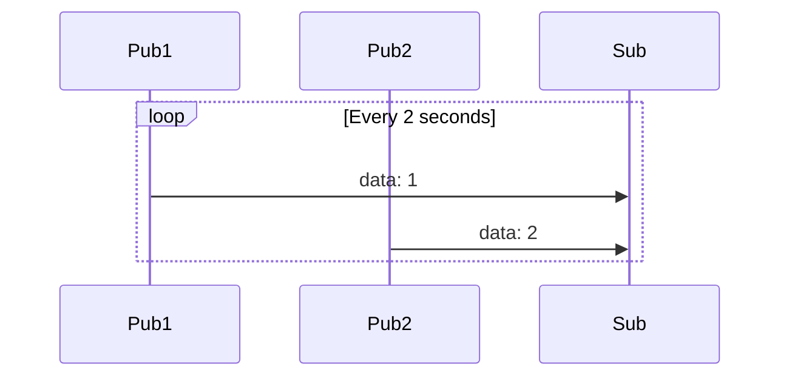

# Multi Publisher & Single Subscriber sample
Zbus multi Publisher & Single Subscriber samples.
Implementation itself is not actually subscriber, but lister.



## Build
```bash
make build
```

## Run
```build
make run
```
